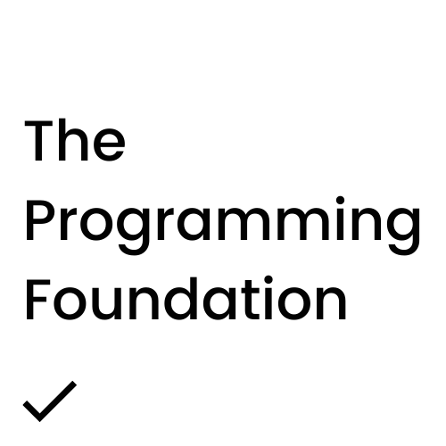
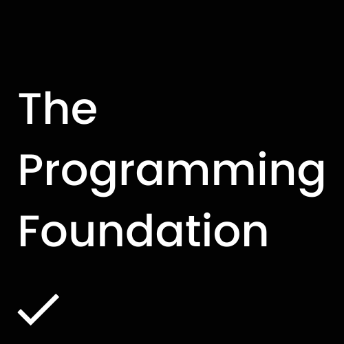
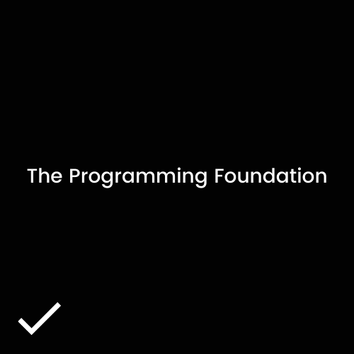
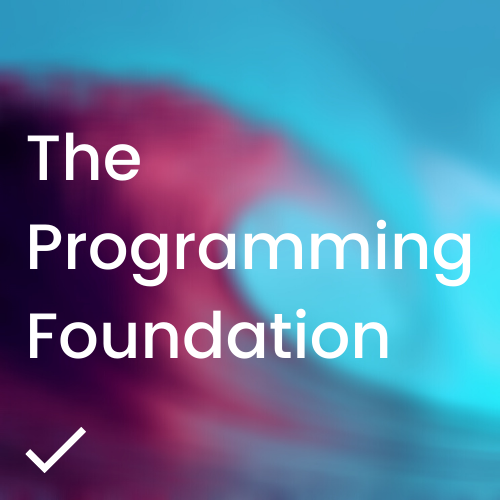
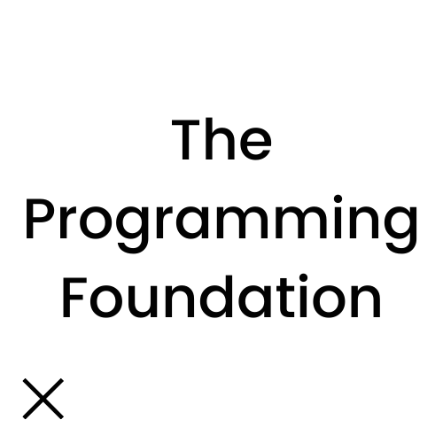
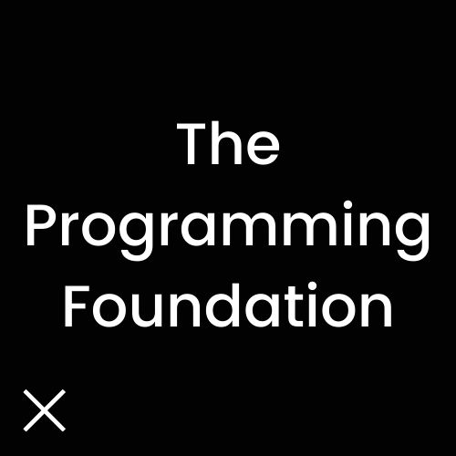
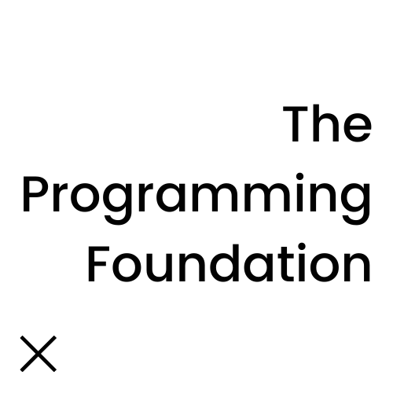
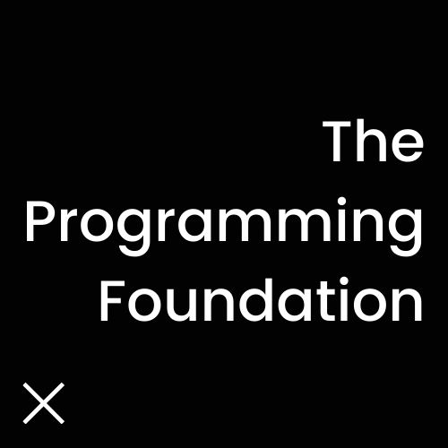

## Brand

### Logo

Our logo is all characters; therefore, it’s simple, adaptive and constantly evolving. We follow basic guidelines to maintain consistency.

**Correct usage:**

**Incorrect usage:**

[Download assets](https://drive.google.com/drive/folders/1cHSnxYxfqoqdVVqAiFZgfqJ-Rrk7CMYu?usp=sharing)

### Typography

We use an open source font known as [Poppins](https://fonts.google.com/specimen/Poppins). The font is designed by [Indian Type Foundry](http://www.indiantypefoundry.com/). The typefaces are licensed under the [Open Font License](https://scripts.sil.org/cms/scripts/page.php?id=OFL&site_id=nrsi).