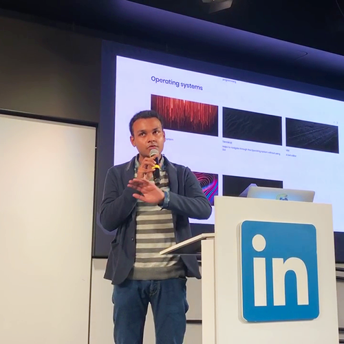
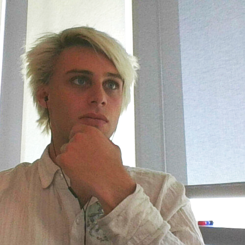
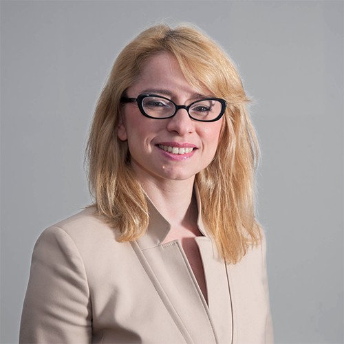

## Leadership

### Executive Team

#### Subhajeet Mukherjee

_Founder, President_

Subha hails from Calcutta, India. He aims to create a smarter general population through The Programming Foundation and the operating system that he’s developing. He has authored two books on operating systems and given talks at HackerDojo, ACM, SF Python, and LinkedIn. His real-life heroes are Bill Gates and Steve Jobs.

#### Theodore Rolle

_Secretary, Technical Advisor_

Theo is a Technical Account Manager at Google. He is an interdisciplinary specialist with over 10 years of Linux experience. He spends his time off playing with robotics, IoT projects, and experimental serverless systems architectures. Theo is overseeing the Reach4Help project.

#### Claudia Caroleo

_Head of Marketing_

Claudia is currently the Program Manager and Marketing Strategist at Maserati. After working in the US and Europe, she went back to her roots in Italy. She is a professional with over 15 years of experience in prestigious automotive brands. She has supported CEOs and executives in defining brand strategies.