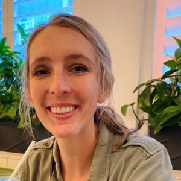

## Podcast

The Programming Foundation’s podcast, **Smarter Together** features exclusive conversations with educationists, industry professionals and our dedicated team of volunteers, as they discuss their journey, inspiration, how software has impacted their lives and what keeps them up at night. It is hosted by our wonderful volunteers, Jamie Rimby and Jen Lindell.

### Meet the hosts

#### Jamie Rimby

Jamie is a licensed professional counselor who, in her free time, can usually be found streaming new episodes from her lengthy podcast subscription feed. Her other full time gig is as parent to a precocious K-12 student. Personally invested in an accessible and effective STEM learning experience for her own child as well as learners of all ages across the world, Jamie will use her authentic and affable style to bring listeners the unique stories of those who teach, build, and inspire as well as the present and future of software development and computer programming.

#### Jen Lindell

Jen is a portfolio manager for a commercial real estate loan servicing company and has been focussing on bridging the gap between IT and business in implementing new tools & processes. She’s an MBA graduate and is diving head-first into the world of The Programming Foundation to listen and learn about programming, about creating resources for students, novices, and experts in the industry, and gaining a deeper understanding of the industry itself. In her spare time, she enjoys baking and traveling.

* * *

### Latest Episodes

